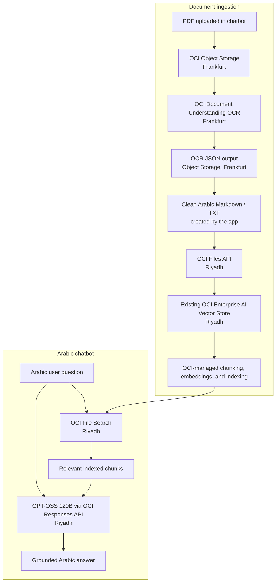

# Bankruptcy Commission Arabic RAG Chatbot

An Arabic chatbot that answers questions from the Bankruptcy Law PDF using OCI services and GPT-OSS 120B.

## Architecture



### How the flow works

1. The app uploads a new PDF to the Frankfurt Object Storage bucket.
2. OCI Document Understanding performs Arabic OCR and writes its JSON result back to that bucket.
3. The app converts the OCR result into clean Arabic Markdown/TXT.
4. The Markdown is uploaded through OCI Files and attached to the existing Riyadh Vector Store.
5. OCI manages chunking, the embedding model, and vector indexing automatically.
6. For every question, File Search retrieves relevant chunks from the Vector Store.
7. GPT-OSS 120B receives the question and retrieved context, then returns a grounded Arabic answer.

The Vector Store is reused. The chatbot does not create a new Vector Store for each document or chat session.

## What is included

- `app.py` - Flask web app and chat API.
- `rag.py` - OCR, file upload, vector-store indexing, File Search, and Responses API calls.
- `index.html` - Arabic RTL chat interface.
- `assets/bankruptcy-commission.png` - Commission logo.
- `documents/Bankrubcy.pdf` - source document.

## Prerequisites

- Python 3.11 or later.
- OCI CLI/configuration already set up at `C:\Users\<your-user>\.oci\config`.
- Access to OCI Document Understanding, Object Storage, Generative AI, and the existing Vector Store.

Install the Python packages:

```powershell
py -m pip install flask oci openai oci-openai httpx
```

## OCI configuration

The app uses `OciUserPrincipalAuth` and reads the standard OCI configuration file directly. Add these non-secret custom values under `[DEFAULT]`:

```ini
compartment_id=<compartment-ocid>
genai_project_id=<genai-project-ocid>
vector_store_id=<existing-vector-store-id>
ocr_bucket=<frankfurt-object-storage-bucket>
```

Do not add keys, passwords, or tokens to this repository.

## Run the chatbot

```powershell
cd <cloned-repository-folder>
py app.py
```

Open http://127.0.0.1:8000/.

The current vector store is reused. The chatbot is ready immediately and does not create a new vector store.

## Add a new PDF

1. Open **Add a new document** in the chat interface.
2. Select the PDF.
3. Choose **Process and index**.

The app sends that new file through OCR in Frankfurt, then uploads its extracted Markdown to the existing Riyadh Vector Store. It does not reprocess already-indexed documents just to start the chatbot.

## Regions

- **Frankfurt (`eu-frankfurt-1`)**: Document Understanding OCR and its temporary Object Storage bucket.
- **Riyadh (`me-riyadh-1`)**: OCI Files, Vector Store, File Search, Responses API, and GPT-OSS 120B.
